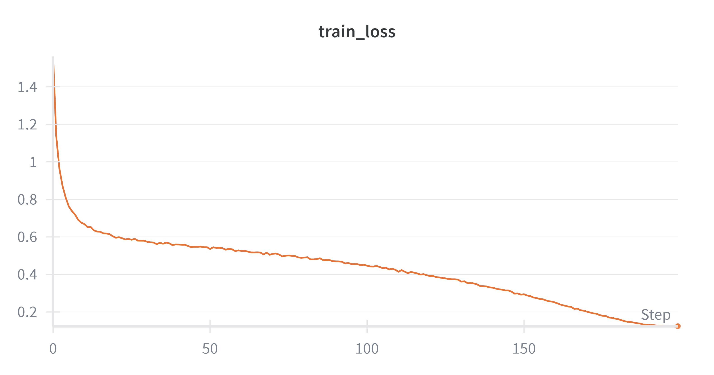
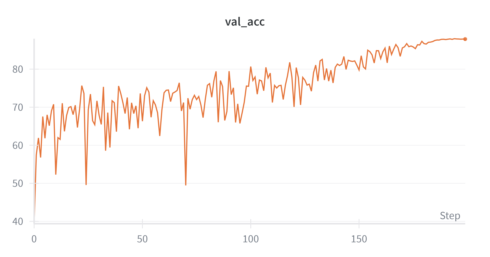
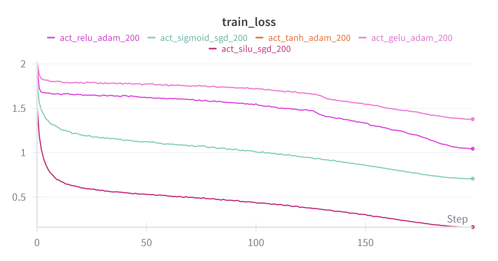
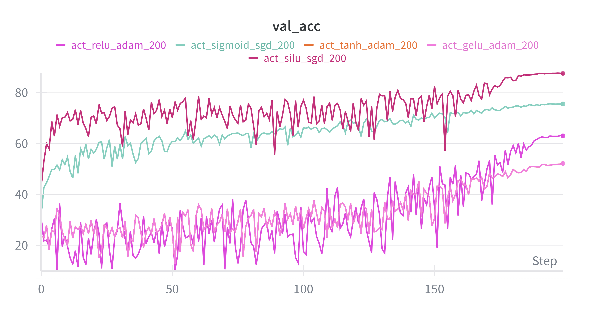
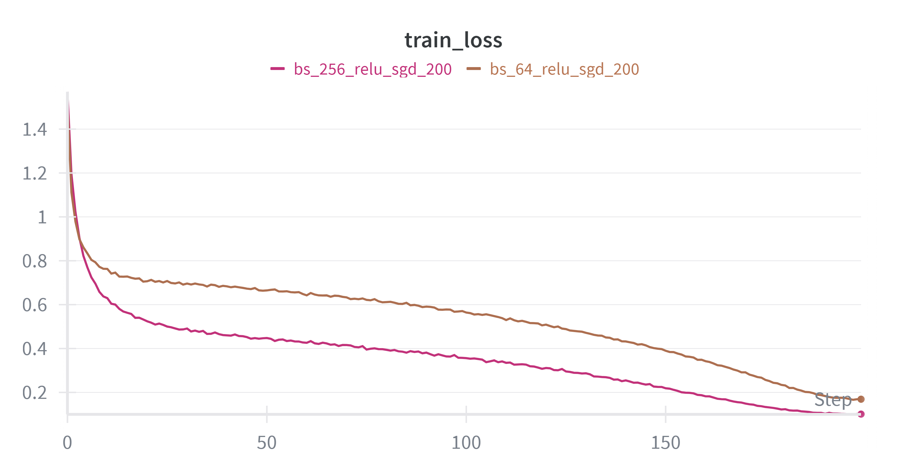
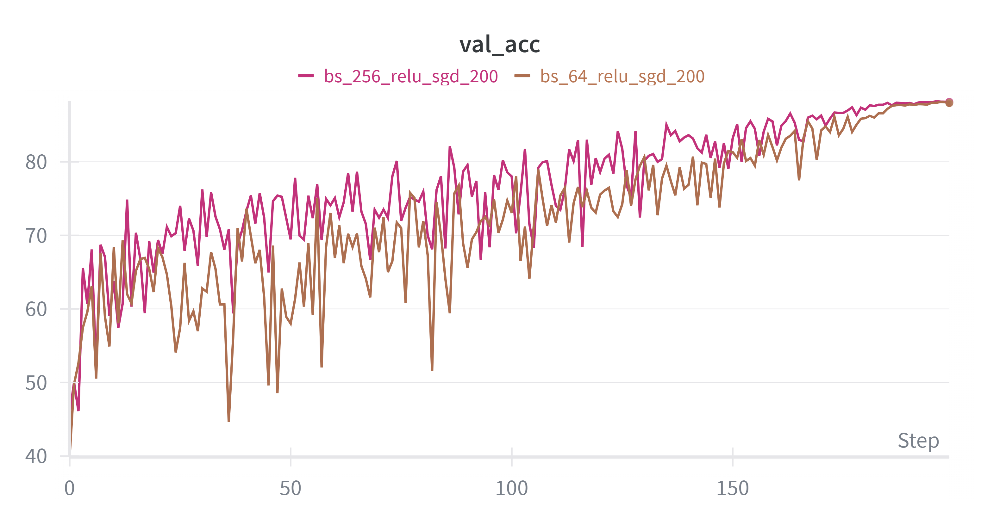
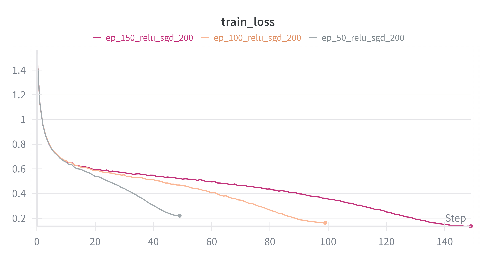
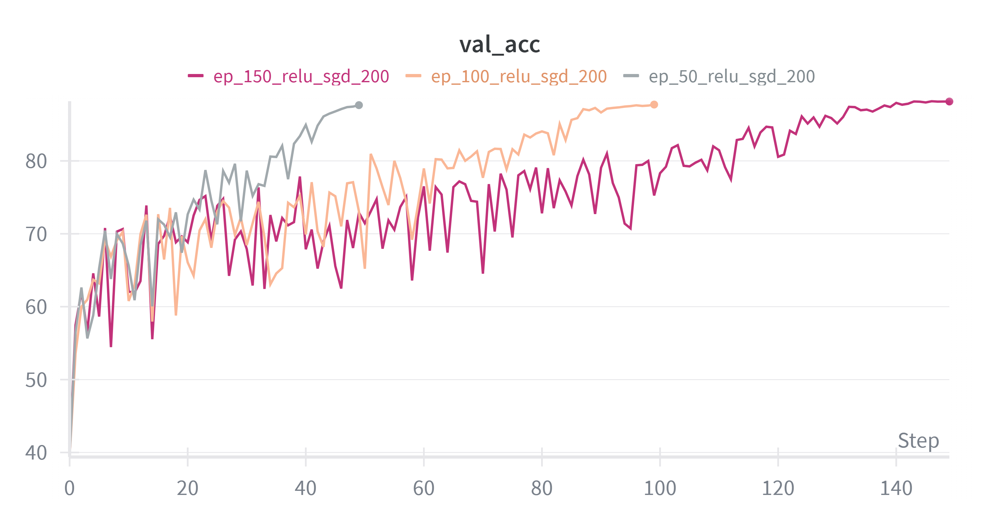
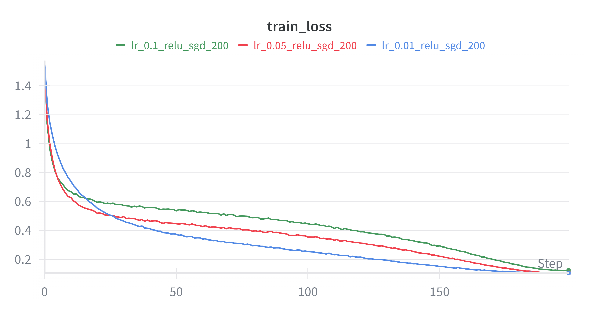
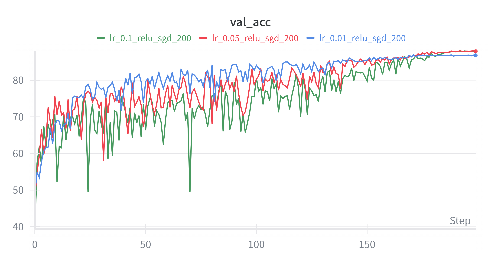

# CS6886W – System Engineering for Deep Learning – Assignment 1

## Topic: VGG6 on CIFAR-10 – training baseline, configuration sweeps, and analysis

GitHub repository: [cs6886w-vgg6](https://github.com/Adamaya/cs6886w-vgg6)

## Environment Setup to train and test the model
- Download the anaconda software and install it. [Download Link](https://www.anaconda.com/download)
- Run the following commands to configure the runtime environment:
```
conda create -n vgg6 python=3.10 -y
conda activate vgg6
pip install torch torchvision matplotlib pandas scikit-learn tqdm seaborn wandb
```

## Question 1. Training Baseline
#### 1(a) CIFAR-10 preparation and transf.30+269-15orms

We use CIFAR-10 from torchvision.datasets (50k train / 10k test, 32×32 RGB).
- Training transforms (data augmentation + normalization):

```
RandomCrop(32, padding=4) – spatial jitter for better generalization

RandomHorizontalFlip() – mirror invariance (p=0.5)

ToTensor() – convert to tensors in [0,1]

Normalize(mean=(0.4914, 0.4822, 0.4465), std=(0.2023, 0.1994, 0.2010)) – channel-wise standardization

(Optional run toggles) Cutout(n_holes=1, length=16) and/or CIFAR10Policy() (AutoAugment) – stronger regularization
```
- Test/validation transforms (no random augmentation):
```
ToTensor()

Normalize((0.4914, 0.4822, 0.4465), (0.2023, 0.1994, 0.2010))
```
#### 1(b) Baseline configuration (single run)

<b>Model:</b> 
  - VGG-6 (cfg: [64, 64, M, 128, 128, M], BN=True) with global average pooling and linear head (128 → 10).
  - Optimizer & schedule: SGD(lr=0.1, momentum=0.9, weight_decay=5e-4) + CosineAnnealingLR (T_max=200).
  - Batch size: 128. Epochs: 200. Seed: 42.
  - Criterion: Cross-entropy. 
  - Device: CUDA if available, else CPU.

(Rationale: SGD + cosine + wd=5e-4 is a strong, standard CIFAR-10 baseline for small VGGs.)

#### 1(c) Baseline results

Final test top-1 accuracy: 87.99%
```
python test.py --model_path "./results/baseline/best.pt" --data_root "../../data" --detailed_analysis
```
Curves: include the two figures below (or W&B exports):

Training loss vs epoch


Accuracy vs epoch (train & val/test)


# Question 2. Model performance on different configurations

We swept activations, optimizers, and training hyperparameters using identical seeds and transforms. For each setting we trained VGG-6 and logged metrics per epoch.

#### 2(a) Varying activation functions with optimizer

Compared: ReLU, GELU, SiLU (Swish), Tanh, Sigmoid.

Observations:

- ReLU: strong baseline; fast convergence; sparse activations; stable.

- GELU / SiLU: often match or slightly exceed ReLU in final accuracy due to smoother gating when used same optimizer; sometimes slower per-epoch.

- Tanh / Sigmoid: typically lower accuracy and slower convergence on CIFAR-10 in deeper nets (saturation/vanishing gradients).

Training loss vs epoch


Accuracy vs epoch (train & val/test)



| Activation | Val Best (%) | Test Best (%) |       Notes         |
|------------|--------------|---------------|---------------------|
| ReLU       | 63.15        | 63.16         | Used Adam Optimizer |
| GELU       | 52.18        | 52.19         | Used Adam optimizer |
| SiLU       | 87.72        | 87.72         | Used SGD Optimizer  |
| Tanh       | 52.18        | 52.19         | Used Adam Optimizer |
| Sigmoid    | 75.66        | 75.67         | Used SGD Optimizer  |

#### 2(b) Varying optimizers

Compared: SGD, Nesterov-SGD, Adam, RMSprop, Adagrad, Nadam.

Observations to check against your runs:

- SGD / Nesterov-SGD: strong final accuracy with proper schedule; Nesterov can converge a bit quicker.

- Adam / Nadam: rapid early convergence; may need lower weight decay; sometimes a bit lower final test acc without tune.

- RMSprop: good with smaller batches; sensitive to LR.

- Adagrad: often underperforms on vision tasks long-term due to aggressive LR decay.

Your measured results (fill):

| Optimizer    | LR   | WD   | Schedule | Val Best (%) | Test Best (%) | Notes |
|-------------|------|------|----------|--------------|---------------|-------|
| SGD         | 0.1  | 5e-4 | Cosine   | 88.00        | 87.99         |       |
| Nesterov-SGD| 0.1  | 5e-4 | Cosine   |              | 72.05         |       |
| Adam        | 1e-3 | 5e-4 | Cosine   | 76.82        | 76.81         |       |
| RMSprop     | 1e-3 | 1e-4 | Cosine   | 81.40        | 81.40         |       |
| Adagrad     | 1e-2 | 0    | Cosine   |              |               |       |
| Nadam       | 1e-3 | 5e-4 | Cosine   |              |               |       |

#### 2(c) Varying batch size, epochs, and learning rate

Keep optimizer=SGD (momentum=0.9, wd=5e-4) and activation=ReLU, then vary one factor at a time:

Batch size: 64 / 128 / 256 – expect faster wall-clock per epoch with larger batch, but may need LR scaling; small batch often generalizes slightly better.
Training loss vs epoch


Accuracy vs epoch (train & val/test)



<b>Epochs: 50 / 100 / 150 </b>– more epochs → higher final accuracy until saturation.

Training loss vs epoch


Accuracy vs epoch (train & val/test)


<b>LR: 0.01 / 0.05 / 0.1 </b>– too low slows learning; too high destabilizes; cosine annealing helps.

Training loss vs epoch


Accuracy vs epoch (train & val/test)



measured results:
| Setting    | Value | Val Best (%) | Test Best (%) | Notes |
|------------|-------|--------------|---------------|-------|
| Batch size | 64    | 88.14        | 88.14         | Used relu activation and sgd optimizer 0.1 learning rate |
| Batch size | 256   | 88.24        | 88.26         | Used relu activation and sgd optimizer 0.1 learning rate |
| Epochs     | 50    | 87.65        | 87.65         | Used relu activation and sgd optimizer |
| Epochs     | 100   | 87.73        | 87.74         | Used relu activation and sgd optimizer |
| Epochs     | 150   | 88.19        | 88.19         | Used relu activation and sgd optimizer 0.1 learning rate |
| LR         | 0.01  | 86.95        | 86.95         | Used relu activation and sgd optimizer |
| LR         | 0.05  | 88.09        | 88.09         | Used relu activation and sgd optimizer |
| LR         | 0.1   | 88.00        | 87.99         | Used relu activation and sgd optimizer |

## Question 3. Plots

Plots were produced automatically; W&B runs are grouped into a project, and we export the charts below.

#### (a) W&B parallel-coordinates plot: each line = a run; axes: activation, batch size, epochs, LR, momentum, optimizer, weight decay, val_acc.

## (b) Validation accuracy vs step (scatter)

## (c) Four curves – train_acc, train_loss, val_acc, val_loss 

# Question 4. Final model performance

Best configuration:
```
activation: relu
optimizer: sgd
lr: 0.1
weight_decay: 0.0005
momentum: 0.9
batch_size: 256
epochs: 200
scheduler: cosine 
seed: 42
```

Best validation accuracy: 88.24%
Corresponding test top-1 accuracy: 88.26%

(Verified by re-running the saved config.)
```
python test.py --model_path "./results/bs_256/best.pt"  --data_root "../../data" --detailed_analysis
```

## Question 5. Reproducibility and repository

Code quality: training, evaluation, and logging are modularized; configs are passed via CLI or YAML.

README: includes exact commands, environment versions, and seed.

Artifacts: best checkpoint and logs are uploaded to the repo; the PDF includes the GitHub link.